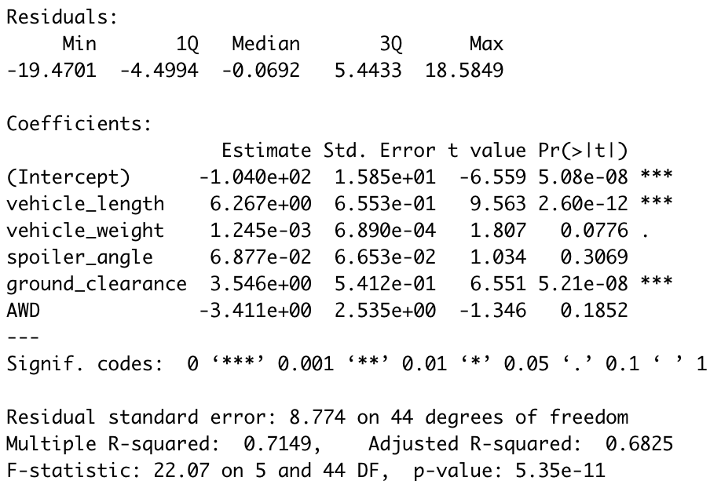
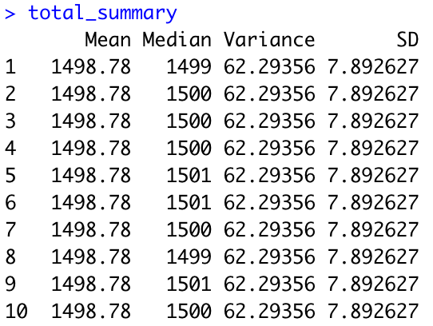
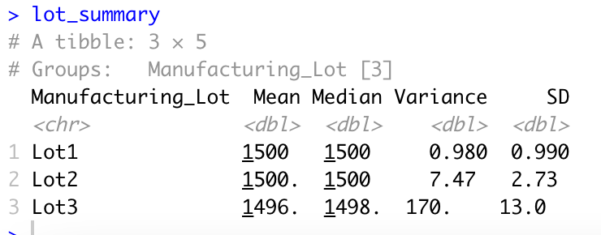
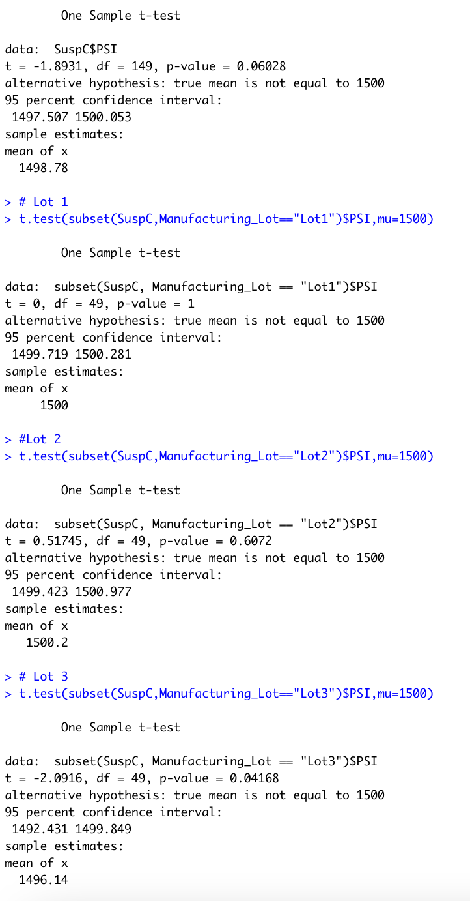

# MechaCar_Statistical_Analysis

## Linear Regression to Predict MPG

1. The vehicle weight, spoiler angle and AWD values are all greated than the 0.05 significance, indicating that these values are not statistically significant. These values are therefore nonrandom.
2. The slope of the line is not zero - when looking at the p-value and the r-squared values, the p-value is significantly smaller, meaning our results are statistically significant. 
3. This model does predict MPG values, but with an about 70% accuracy. The r-squared value in this model is 0.7149, meaning that about 71.49% of these values will actually land on the linear regression line. So somewhat? Not fully accurate. If we could get the r-squared value higher, this regression would be much more useful. 

## Summary Statistics on Suspension Coil

Looking at the total_summary and lot_summary data, there is no indication that anything exceeds the design specifications by anything close to 100 pounds per square inch. In the total_summary data, the variance and standard deviation is at a steady 62.29 and 7.89, with the median slightly fluctuating. However, as far as the lot_summary data, lots 1 and 2 look like they meet design specifications, but lot 3 is off, with a 170 variance and 13 standard deviation. Lot 3 does not meet design specifications.

## T-Tests on Suspension Coils

When looking at all data combined (the first part of the t-test screenshot below), the p-value is 0.06028, which does not reject the null hypothesis - the data is not statistically significant, this value is greater than 0.05. When looking at the lots individually, lots 1 and 2 both show data that is not significant (with p-values much greater than 0.05), and only lot 3 having a p-value smaller than 0.05. With this data, there is no reason to reject the null hypothesis, since the data is not statistically significant.

## Study Design: MechaCar vs Competition

The MechaCar goal is to ultimately outperform competition and appeal better to consumers. One big thing, especially nowadays, would be to focus on the fuel effiency of the vehicle. Since we've been already analyzing data that has to do with MPG, we can take a look at city and highway MPG efficiencies. If marketing this vehicle in a more urban environment, city MPG would be the most interesting thing for consumers to take a look at. 
Data to gather/test:
- MPG of vehicles including similar weight class/structure within city limits
- MPG of vehicles on highways

Null hypothesis: there is no value in purchasing a MechaCar, the MPG is not significantly better/worth it compared with other vehicles
Alternative hypothesis: MechaCar has the better MPG in city limits and on highways, mean MPG is higher

As far as specific tests, I would do t-tests, just like the ones done in this challenge. They can be two-sided or one-sided, as long as the data is comparable. 

Data to run the test:
- Average MPG for vehicles from various competitors
- Numerical (ideally csv files) in order to import them into R and perform these analyses
- MPG compared with various vehicle qualities (similar to the csv we used in this challenge)
